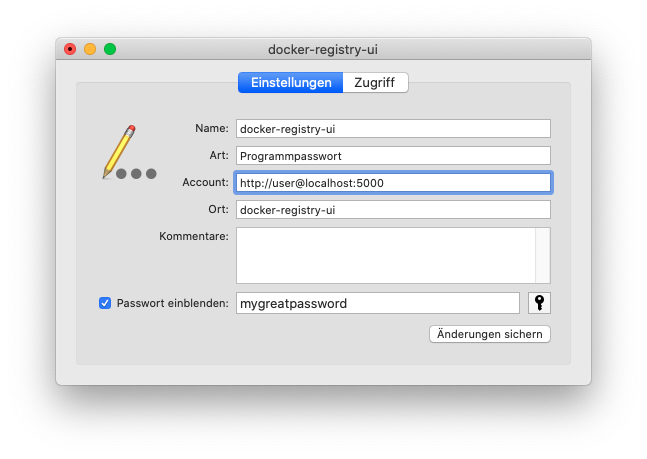

# Standalone Application

## Overview

This standalone application is based on Electron which encapsulates the whole
docker-portainer-ui in a single executable, that can be run on your local
computer.

## Building

Navigate to the ```electron``` directory and execute following commands to build
the executable:
```bash
npm run dist
```

## Password Protected Registries
This application will use the keystore of your system instead of asking you for
the password in the standalone application. This is accomplished with the
[keytar](https://www.npmjs.com/package/keytar) package.

Passwords can not be added via the application itself, but they can be added via the
Keychain on macOS or Windows Credentials Vault.

As service or name specify ```docker-registry-ui``` and the account name should
be the host of your Docker Registry including the name that is used for the
authentication process (see screenshots below).
The password is specified in the password field.




