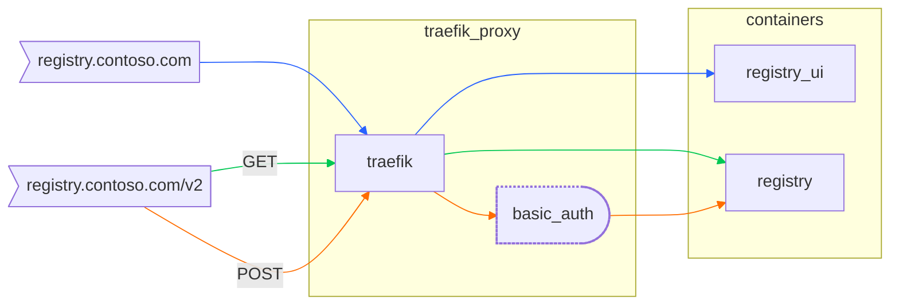

# Single URL Docker Registry UI for Docker Swarm

Swarm-compliant UI with public registry PULLs and authenticated registry PUSHes with Traefik v3.

## Features

* Unauthenticated PULLs
* Authenticated PUSH/DELETEs
* Single URL (registry and ui on the same domain)
* Let's Encrypt enabled
* Authenticated Traefik Dashboard

## Introduction

This configuration is designed to be a "single-serving" quickstart for homelab or development environment.
It is built to be modular enough to easily break apart for larger or more production environments for the
more advanced scenarios.

It serves both a container registry and Joxit's Docker-Registry-UI on the same URL over HTTPS that can be
secured with certificates from Let's Encrypt.  The registry allows for public PULLs and authenticated PUSHes.

Additionally, the **traefik** dashboard UI is published (although you do not need it during production) on
port 8443 because [traefik hardcodes](https://doc.traefik.io/traefik/operations/api/#dashboard) the paths
`/dashboard` and `/api`, plus it is just good practice to logically separate your administrative endpoints.

## Prerequisites

### Internet-Facing

As committed, this uses Let's Encrypt for certificates, so port `:443` must be forwarded to your swarm to
use the TLS challenge.

> [!WARNING]
> By default, you are set to use Let's Encrypt production certificate environment.  During testing, you are
advised to use the staging environment so you are not locked out from generating certificates due to a
misconfiguration.

### `.env` File

The `.env` file makes it easy to perform all the replacements necessary.

> [!TIP]
> You may opt to find and replace the variables in the yaml file rather than relying on environment variables.

```shell
# Name of the stack within docker swarm
STACK=registry
# Name of the domain to register with traefik
DOMAIN=contoso.com
# Leave blank if not using Let's Encrypt
RESOLVER=letsencrypt
# Email address for Let's Encrypt
EMAIL=postmaster@contoso.com
```

## Uppies

> [!WARNING]
> If using environment variables, ensure that you have loaded them
> (e.g. `source .env` ) before bringing up the stack.  Alternatively
> you can use `envsubst` to interpolate them at runtime.

```shell
❯ docker stack deploy -c swarm.yml $STACK
Creating network registry_frontend
Creating service registry_traefik
Creating service registry_redis
Creating service registry_registry
Creating service registry_ui
Creating service registry_error-pages
```

### Accounts

#### dashboard

Traefik's dashboard account is:

* Username: `admin`
* Password: `hunter2`

#### registry

The registry account is:

* Username: `user`
* Password: `hunter2`

## Mermaid Diagram



## Contributors

* [@jnovack](https://github.com/jnovack)
* [@agahkarakuzu](https://github.com/agahkarakuzu)
* [@onizet](https://github.com/onizet)
